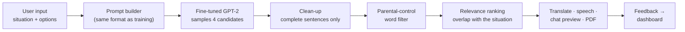

# 🎭 Excusify

**Situation-aware excuse, apology and urgent-message generator.** Three GPT-2 models, each fine-tuned on a hand-written dataset, served through a Streamlit app with translation, text-to-speech, chat-style previews, PDF export and a feedback dashboard.

[](https://huggingface.co/spaces/Sohamb2005/excusify-app)
[](https://huggingface.co/Sohamb2005)
[](https://colab.research.google.com/github/soham200521/Excusify/blob/main/training/train_excusify.ipynb)


<!-- Add a screen recording of the app here, it is the first thing a visitor looks at:

-->

---

## What it does

| Mode | You enter | You get |
|---|---|---|
| **Excuse** | What it's for (*"forgot to submit the report"*), context (work, school, family, social), urgency and believability | A one- or two-sentence excuse written for that situation |
| **Apology** | What you're apologising for and a tone (emotional, professional, informal) | An apology that names the situation and, in the professional tone, how you'll fix it |
| **Emergency** | One of 8 scenarios (car trouble, medical issue, stuck somewhere, …) and optional details | A short, first-person urgent message you could send to a manager, teacher or friend |

Every result can be translated into 10 languages, played back as audio, previewed as a chat or text message, exported as a PDF and rated. Ratings feed a dashboard with a leaderboard of the best-rated excuses.

## How it works



Each mode has its own model. The app turns the form into the exact text format the model was trained on, for example:

```
work | medium | high | forgot to submit the report :
```

and the model writes the completion after the colon, then stops with an end-of-text token. Four candidates are sampled; the app drops incomplete or filtered ones and keeps the candidate that mentions the most words from your situation.

## Datasets

All three datasets were written by hand for this project and live in [`data/`](data).

| File | Rows | Columns | Coverage |
|---|---|---|---|
| [`excuses.csv`](data/excuses.csv) | 864 | Scenario, Situation, Urgency, Believability, Excuse | 4 scenarios × 6 situations, each situation phrased 4 ways; every scenario × urgency × believability combination has exactly 24 rows |
| [`apologies.csv`](data/apologies.csv) | 285 | Type, Situation, Apology | 3 tones (99 emotional, 96 professional, 90 informal) across 24 situations, each phrased 3 ways |
| [`emergency_messages.csv`](data/emergency_messages.csv) | 226 | Scenario, Details, Message | 8 scenarios with 28–30 messages each; 161 rows include details, the rest teach the model to handle an empty details field |

What the labels mean:

- **Urgency**: *low* is a minor slip (overslept), *medium* a real problem (car wouldn't start), *high* an emergency (a family member in hospital).
- **Believability**: *high* is ordinary and easy to believe, *medium* unusual but possible, *low* absurd on purpose (*"a monkey ran off with my office ID"*).

Quality checks: no duplicate texts, straight apostrophes only, and no row contains a word blocked by the app's parental filter.

## Training

The notebook [`training/train_excusify.ipynb`](training/train_excusify.ipynb) trains and uploads all three models (a few minutes on a free Colab T4 GPU).

| Setting | Value |
|---|---|
| Base model | `gpt2` (124M parameters), one model per mode |
| Example format | `scenario \| urgency \| believability \| situation : excuse<\|endoftext\|>` |
| Objective | causal LM loss on the completion **and its end-of-text token**; prompt tokens are masked |
| Split | 90 / 10, stratified by scenario or tone |
| Hyperparameters | 5 epochs, learning rate 5e-5, batch size 8, cosine schedule, 10% warm-up |
| Model selection | best epoch by held-out loss |

Held-out loss and perplexity, before and after fine-tuning, are printed by step 8 of the notebook and recorded in each model card:
[excuses](https://huggingface.co/Sohamb2005/gpt2-finetuned-excuses) ·
[apologies](https://huggingface.co/Sohamb2005/gpt2-finetuned-apologies) ·
[emergency messages](https://huggingface.co/Sohamb2005/gpt2-finetuned-emergency).

<!-- Paste the table printed by step 8 of the notebook here. -->

## What changed in v2

The first version generated text that often didn't make sense or ignored what the user typed. Tracking down why:

1. **Training and inference used different prompts.** The models were trained on `work | high | high : …` but the app sent full sentences such as *"Craft a medium, normal urgency excuse for …"*. Prompt building now lives in one set of functions, copied into the notebook and the app, and a test checks that both produce identical text.
2. **The model never learned to stop.** With `pad_token = eos_token`, `DataCollatorForLanguageModeling` masks every end-of-text label, so the model rambled and the app had to cut text at the first full stop. Labels are now built by hand so the end-of-text token is a training target.
3. **The data didn't say what an excuse was for.** The old rows only had scenario, urgency and believability, so the "what do you need an excuse for?" box couldn't influence the output. The datasets were rebuilt around a `Situation` column. The old excuse data was also 33% duplicates, and 270 excuses appeared under conflicting labels.
4. **App bugs.** Feedback was lost because the feedback form only existed during the button-click rerun. The dashboard leaderboard never showed because of a pandas merge-suffix mistake. The parental filter matched substrings, so "dead" blocked "deadline" and "hang" blocked "change". Chinese translation used an invalid language code.
5. **Removed what didn't work.** A random "location log" (coordinates and addresses that didn't match), and "ranking" and "prediction" claims that the code didn't actually implement.

## Run it locally

```bash
git clone https://github.com/soham200521/Excusify.git
cd Excusify
pip install -r requirements.txt
streamlit run app.py
```

Each model (about 500 MB) is downloaded from the Hugging Face Hub the first time its mode is used. Translation and speech need an internet connection.

## Project structure

```
Excusify/
├── app.py                      # Streamlit app
├── requirements.txt
├── data/
│   ├── excuses.csv
│   ├── apologies.csv
│   └── emergency_messages.csv
├── training/
│   └── train_excusify.ipynb    # fine-tuning, evaluation, model cards, upload
└── LICENSE
```

## Tech stack

Python · PyTorch · Hugging Face Transformers · Streamlit · pandas · Plotly · Pillow · ReportLab · gTTS · deep-translator · Google Colab

## Limitations

- GPT-2 is a small model and the datasets are small, so it sometimes repeats phrasings from the data or gives generic answers to situations far from what it has seen.
- The parental filter is a keyword list, not a classifier.
- Translation (Google Translate) and speech (gTTS) are external services; previews and PDFs stay in English because the bundled fonts don't cover every script.
- Built for fun and for practising awkward messages. Please don't use it to mislead people in ways that could hurt them.

## Author

**Soham Bacchuwar** · [GitHub](https://github.com/soham200521) · [Hugging Face](https://huggingface.co/Sohamb2005)

First version May 2025; v2 (new datasets, retrained models, rebuilt app) October 2026.

## License

MIT, see [LICENSE](LICENSE).
